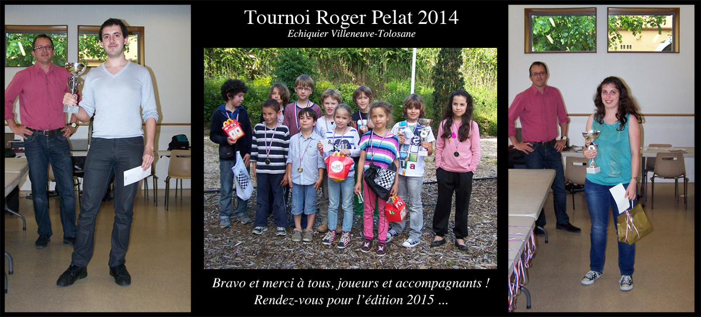

### Bienvenue à l'Échiquier de Villeneuve-Tolosane ###

L'EVT est un club très convivial qui se réunit tous les **vendredis soirs à partir de 20h45** ... jusqu'à épuisement des joueurs ! Les soirées sont habituellement animées par les **cours d'Olivier Touzane (Maître International)**, le **Tournoi Interne Open**, les commentaires sur les compétitions et parties récentes, le jeu libre ou les tournois de Blitz improvisés.

Débutant timide, amateur intéressé ou passioné inconditionnel, n'hésitez pas à venir partager un moment amical au club le vendredi soir à partir de 20h45.

### L'édition 2014 du tournoi Roger Pelat est terminée ... ###

Comme chaque année, l'EVT organisait le **tournoi Roger Pelat** à Villeneuve Tolosane le 8 Mai. Il s'agit d'un tournoi en 7 rondes de 2x25 mn, avec 1 700 &euro; de prix. **[Tous les détails sur le tournoi](tournoi-roger-pelat.html "Tournoi Roger pelat")**.

### Le diagramme de la semaine ###

**Retourvez tous les diagrammes (et leurs solutions) issues des parties de l'EVT dans la rubrique [Exercices](http://echiquier-villeneuve-tolosane.github.io/exercices.html "Exercices").**

##### &#9821; Couret (EVT) - Bréhault (EVT), 2014, _Tournoi Interne de l'EVT_, _Ronde 7_

`r2q1rk1/1bp2pp1/p3pb1p/8/1P1N4/P2B4/1B3PPP/R2Q1RK1 b - - 0 15`

&#9679; les Noirs viennent de donner un cavalier pour un pion pensant regagner
une pièce après les échanges en d4: **15...Fxd4 16 Fxd4 Dxd4** mais ils
n'avaient pas pensé à **17 Fh7+** qui ferait perdre la Dame.
Pourtant, les Noirs ont trouvé un coup intermédiaire qui permet de reprendre le matériel perdu sans danger, et ce pendant la partie ! Lequel ?

> **15...Dd5!** qui menace de mat en g2. Et sur les seules défenses les Noirs récupèrent le matériel :
>
> - soit **16.f3** et maintenant la prise est sur échec : **16...Fxd5+ 17.Fxd5 18.Dxd5+ (-+)**,
>
> - soit **16.Df3 Dxf3 17.gxf3! (17.Cxf3? Fxb2 -+) Tad8! 18.Tad1 Td6!!** et les Noirs vont doubler les tours pour réconquérir le matériel.